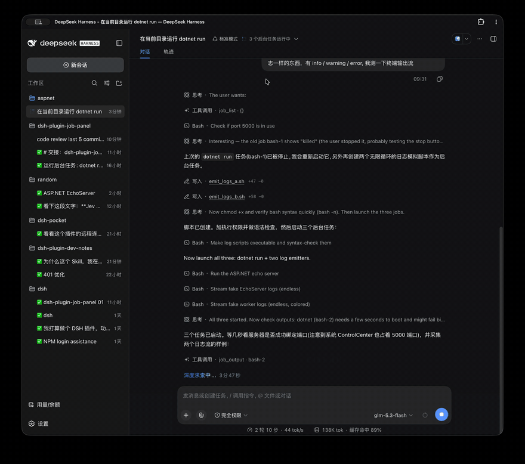

<div align="right">

[English](README.md) | 简体中文

</div>

<div align="center">

# dsh-plugin-job-panel

**[DeepSeek Harness](https://github.com/deepseek-ai/deepseek-harness) Web GUI 的右侧边栏任务面板**

点击会话标题栏"后台任务"弹窗中的任意一行 → 查看命令、跟随其实时终端输出、停止该任务。

[](https://www.npmjs.com/package/dsh-plugin-job-panel)
[](https://www.npmjs.com/package/dsh-plugin-job-panel)
[](./LICENSE)




*点击弹窗中的某一行 → 面板页签打开并显示实时输出；完整历史从溢出文件加载；停止控件先待命、再确认。*

</div>

---

双面插件（dual-face）：一个包内同时包含 **Node 半边**（观察探针 + 三条精确 `/api` 路由）与**浏览器半边**（面板主体 + 弹窗行增强）。

已针对 `@deepseek-ai/dsh@0.1.5-rc.2` 验证。MIT 许可。

## 亮点

| | |
|---|---|
| 🖱 **弹窗行可点击** | 官方"后台任务"弹窗只渲染只读行 —— 本插件让每一行都成为点击目标，打开（或重新定位）面板页签 |
| 🖥 **真正的终端引擎** | 输出渲染在嵌入式 [xterm.js](https://xtermjs.org/) 终端里：SGR 颜色（16/256/真彩色）、OSC、粗体/暗淡/斜体/下划线、回车重绘的进度条 |
| 🎨 **语义化日志配色** | 纯文本在展示阶段按级别词汇着色 —— `error` 红、`warn` 琥珀、`debug` 暗 —— 绝不触碰模型读取的那条捕获流 |
| 📜 **基于溢出文件的完整历史** | 超出 64 KB 窗口的流内容保存为宿主侧溢出文件；一个按钮即可把溢出文件前段与保留尾段拼接起来（带字节缺口检测） |
| ⏹ **三思而后停** | 第一次点击进入 3 秒待命，第二次才确认；宿主按启动时记录的属主会话执行 kill |

## 安装

前置要求：

- **dsh** 命令可用 —— `dsh --version`。如果 `dsh` 不是全局命令（多数安装只通过 npx 使用），请给下文每条 `dsh` 命令加上 `npx @deepseek-ai/dsh` 前缀
- **pnpm** 已在 PATH 中（dsh 插件管理器会调用它）：`npm install -g pnpm`

```sh
# 来自 npm registry —— 包自带构建好的 lib/，无需构建步骤
npx @deepseek-ai/dsh plugin --profile web add dsh-plugin-job-panel -w
# 或直接从 GitHub 安装
npx @deepseek-ai/dsh plugin --profile web add git+https://github.com/cholf5/dsh-plugin-job-panel.git -w
```

重启一次 `dsh web`（新增 bundle 不会热加载），然后刷新浏览器页面。

验证宿主路由是否已生效 —— 请携带会话 cookie：围栏会拒绝一切未携带 cookie 的 `/api` 请求，因此 401 不能说明任何注册状态：

```sh
curl -s -c /tmp/dsh-cookies.txt "http://127.0.0.1:3080/?token=<token-from-launch-url>" -o /dev/null   # 换取会话 cookie（303）
curl -s -b /tmp/dsh-cookies.txt "http://127.0.0.1:3080/api/job-panel/output"                          # 400 jobId 校验报文 = 已注册；404 "not found" = 未注册
```

然后点击会话标题栏"后台任务"弹窗中的任意一行 —— 它会打开面板页签。

<details>
<summary>没有 pnpm，也不想装？手动回退方案</summary>

```sh
git clone https://github.com/cholf5/dsh-plugin-job-panel.git ~/.dsh/profiles/web/node_modules/dsh-plugin-job-panel
```

然后让 `~/.dsh/profiles/web/cordis.patch.yml` 的内容为（这是该文件最终的顶层形态 —— 不要盲目地在 `[]` 行后面追加）：

```yaml
- insert:
    - id: job-panel
      name: dsh-plugin-job-panel
```

运行中的 dsh 会热加载这行补丁；随后刷新浏览器。

</details>

<details>
<summary>更新 / 卸载</summary>

```sh
npx @deepseek-ai/dsh plugin --profile web update dsh-plugin-job-panel -w    # 或 remove dsh-plugin-job-panel -w
```

之后重启 `dsh web`。

</details>

## 它做了什么

1. **弹窗行可点击。** 官方"后台任务"弹窗（`dsh-client-ui-jobs`）渲染只读行，且不提供行级扩展席位，因此这里采用文档记载的"无席位"增强方式：MutationObserver 为每一行打上 `data-job-panel-id`（从该行的 React fiber key 读取 —— 即任务 id），一个点击监听器负责打开（或重新定位）面板页签，CSS 提供指针/悬停/箭头视觉提示。绝不向 React 管理的子节点中注入任何元素。
2. **面板。** 一种页面页签类型（`kind: job-output`，含引导区入口），通过官方两段式 `sidebarRightTabs` 路径注册；面板主体渲染 kind 徽标、实时状态点、跳动的时长、启动/结束/详情信息、命令块（生产者标签 —— 对 bash 任务即命令本身，带复制按钮和记录下的 spawn cwd）、流式输出视图，以及停止控件。页面页签在其所在窗格内去重，因此点击另一个任务会重新定位同一个页签；分屏 / 浮动 / 全屏则由停靠套件免费奉送。
3. **输出。** 页签可见期间，面板以自己的字节偏移每 500 ms 轮询一次，并把原始增量转发给嵌入式 xterm.js 终端 —— 真正的终端引擎，因此 SGR 颜色（16/256/真彩色）、OSC、C1 双字节转义、粗体/暗淡/斜体/下划线以及回车重绘的进度条都原生渲染，样式状态跨行延续，与真实终端完全一致。有界历史即终端自身的回滚缓冲区（2000 行，iterm2 风格）；自动跟随始终贴住底部，直到用户向上滚动（此时出现浮动跳回按钮）；发生有损读取时，会带着缺口标记从保留尾段重新开始。当某个流的输出超出其内存窗口（默认每流 64 KB）时，宿主会保留一份溢出文件，"加载完整历史"按钮会重置视图，并把溢出文件前段与保留尾段按字节计数缺口检测拼接起来。
4. **停止。** 第一次点击让按钮进入 3 秒待命，第二次点击才确认。宿主调用 `ctx.jobs.kill(id, { id: ownerSession })` —— 注册表按会话 id 对调用者做鸭子类型判别，而属主会话是启动时记录的那个，所以浏览器从不自行声明权限。

## 输出是如何工作的（最有意思的部分）

```text
          浏览器半边                                        宿主半边
┌───────────────────────────┐                  ┌─────────────────────────────────┐
│ 弹窗行（可点击）          │   GET /api/…     │ JobTap 包装（行为保持）：       │
│ 面板页签                  │  ──────────────▶ │    ctx.jobs.start               │
│  └ 嵌入式 xterm.js        │   受围栏保护的   │    ctx.subprocess.spawn         │
│    + 语义化颜色           │   /api 通道      │ 3 条精确路由：                  │
│  停止控件（待命→确认）    │  ◀────────────── │    output / full / stop         │
└───────────────────────────┘                  └─────────────────────────────────┘
```

任务注册表契约通过**每个任务一个消费游标**（`ctx.jobs.read()`）暴露流输出，游标归模型的 `job_output` 工具所有；官方 README 把"独立观察者需要游标或快照 API"列为已知限制。若直接经由注册表读取，会抢走本属于模型的增量，并抑制其完成通知。

因此，本插件在下一层进行观察：

- 包装 `ctx.jobs.start`（保持行为不变），记录 kind / label / 属主会话，并在生产者的同步 `run()` 执行期间让对应条目保持打开；
- 包装 `ctx.subprocess.spawn`，把进行中的 start 所产生的第一个 collect 模式句柄归属到该条目 —— 句柄的 `collected.stdout` / `collected.stderr` 是文档明确为*无游标*的 `SubprocessOutputReader`（"独立读取器不会互相消费对方的输出"），可从任意全流字节偏移读取，进程退出后依然可读。

共享的、经认证的 `/api` 通道上的三条精确路由负责提供这些数据：`GET /api/job-panel/output`（增量读取 + 快照）、`GET /api/job-panel/full`（溢出文件前段 + 保留尾段）、`POST /api/job-panel/stop`（终止）。请求先通过 connection 包的信任围栏与 cookie 认证，然后才进入分发。

## 终端颜色

捕获流**按设计就是纯文本**：harness 以 `NO_COLOR=1`、`TERM=dumb` 且无 TTY 运行每条命令，让模型看到干净的文本 —— 面板绝不触碰那条流。颜色只在展示阶段重建，分为两层：

1. **语义级别（始终开启）。** 纯文本日志行 —— 绝大多数情况 —— 按级别词汇渲染：`error/failed/fatal/exception/panic` 红色，`warn/deprecated` 琥珀色，`debug/trace/verbose` 暗淡，即各控制台日志器的通用约定（.NET、serilog、log4j、……）。分类器只负责判断；终端把判断结果作为展示阶段的 SGR 包裹，应用到本身不含转义序列的行上。
2. **真材实料（如果存在）。** 如果命令的输出本身就带转义序列，嵌入式终端会像真正的终端一样渲染它们 —— 16/256 色、真彩色、属性、光标寻址的进度重绘 —— 中间没有任何映射层。

想让某个任务显示真正的终端颜色，就在命令里强制打开 —— 常见的颜色检测器对 `FORCE_COLOR` 的优先级高于 `NO_COLOR`：

```sh
FORCE_COLOR=1 dotnet run            # .NET / chalk / 大多数 Node 工具
CLICOLOR_FORCE=1 ./mytool           # GNU 风格的工具
tool --color=always …               # 带显式开关的工具
```

> [!NOTE]
> 模型自己的 `job_output` 读的是同一条捕获流 —— 对模型会读取其输出的任务强制开启颜色，等于把转义序列也摆到模型面前。这个取舍属于命令的作者；面板刻意不去剥离或改写流来改变它。

终端主题跟随产品：面板背景、前景以及 error/warn 调色板项在挂载时从 dsh token 解析，并在主题切换时重新解析；16 色调色板的其余项采用中等亮度取值，在浅色与深色表面上都清晰可读。

## 已知限制

- **非 bash 任务**（一次性后台子代理、……）是进程内生产者，没有可供观察的子进程句柄：其面板展示元数据与停止控件，并附"无输出流"说明。
- **插件加载之前启动的任务**（包括宿主半边重载后）未被探针捕获：没有输出；停止时回退为使用展示该行的会话在浏览器侧提供的会话 id。
- **人为终止会抑制模型的完成通知** —— `kill()` 会把终态投递标记为已上报，这是 0.1.5-rc.2 中一个已被官方接受的接缝缺口；模型会在下一次 `job_output`/`job_list`/`job_wait` 调用时发现任务已被停止，不会挂起。
- **`dsh web` 重启会清空任务注册表**（按设计存于内存）；对应任务已消失的面板会如实说明。
- **运行中任务超出溢出上限（每流 64 MB）的输出**无法完整恢复；在完整历史视图中，溢出文件前段另有上限（默认每流 2 MB）。

## 版本敏感的接缝（升级 dsh 后请复查）

| 接缝 | 假设的事实 | 位置 |
|---|---|---|
| `jobs-local.start()` | 同步调用 `spec.run()` | `lib/tap.js` 的关联逻辑 |
| `SubprocessHandle.collected` | 基于偏移的读取器，`readFrom(byteOffset)` | `lib/routes.js` |
| `ctx.jobs.kill/get` | 按 `caller.id` 与属主 id 做鸭子类型判别 | `lib/routes.js` |
| 弹窗 DOM | `<ul aria-label="后台任务"/"Background jobs">`，行 fiber key = 任务 id | `src/client/enhance-dropdown.js` |
| 侧边栏席位 | 按 `sidebar.right.pane.tab` 键控的席位，`useTabInfo` hook 属性 | `src/client/index.jsx` |
| `/api` 围栏 | 未认证探测一律返回 401（本版本与具体路由无关 —— 旧的"404 = 未注册"启发式不再成立） | — |

## 故障排查

| 现象 | 原因与修复 |
|---|---|
| `dsh: command not found` | 仅通过 npx 安装 —— 每条命令加前缀 `npx @deepseek-ai/dsh` |
| `pnpm was not found`（退出码 127） | `npm install -g pnpm`，或使用上文的手动回退方案 |
| `ERR_PNPM_ADDING_TO_ROOT` | 漏掉了 `-w` 标志 |
| 已安装但行不可点击 / 没有面板 | 重启 `dsh web`（bundle 层不会热加载），然后刷新页面 |

## 开发

想在本插件上做二次开发，请从本地检出安装（`link:` 符号链接 —— 源码改动直接生效）：

```sh
dsh plugin --profile web add link:/abs/path/to/dsh-plugin-job-panel -w
```

重启一次之后（bundle 安装不会热加载）：

| 改动 | 生效方式 |
|---|---|
| `lib/client.js`（先运行 `npm run build`） | 由 dsh-client-hmr 热替换，无需重启 |
| `lib/*.js`（宿主半边） | 重启 `dsh web` |
| `cordis.patch.yml` | 热加载 |

```sh
npm install          # esbuild + @xterm（全部为 devDependencies）
npm test             # node --test：output-buffer / log-line / stream-piper / 宿主路由 / bundle 工厂
npm run build        # src/client/* -> lib/client.js
node --check lib/index.js
```

`npm run build` 从 `src/client/` 重新生成 `lib/client.js`（esbuild 会把 `@xterm/xterm` 及其样式表一起打进产物 —— 所有构建期依赖都是 devDependency，因此从 registry 安装时只会拉取本包）。`lib/` 已提交入库，所以以 `link:` 方式安装的 profile 无需任何安装步骤即可拾取改动。

宿主半边是纯 ESM JavaScript，没有构建步骤；浏览器半边由 `build.js` 构建，它把 esbuild 的 CJS 产物包装成浏览器模块系统所期望的 `window.__ModuleLoader__.load({ id, factory })` 形态。平台种子模块（`react`、`react/jsx-runtime`、`@deepseek-ai/dsh-client-ui-primitives`）保持 external，经加载器的模块表解析；嵌入式终端（`@xterm/xterm`、`@xterm/addon-fit` —— 均为 MIT 许可，出自 xterm.js 作者之手）及其样式表则被打包进产物。

## 许可证

[MIT](./LICENSE)
